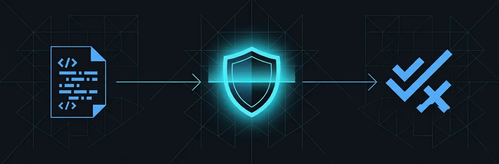

<p align="center">
  
</p>

<h1 align="center">Skill Shielder</h1>

<p align="center">
  Security audit tool for <a href="https://docs.anthropic.com/en/docs/claude-code">Claude Code</a> skills, MCP servers, and repositories.<br>
  Scan before you install, so you don't have to trust blindly.
</p>

<p align="center">
  <strong>Zero dependencies.</strong> Pure bash. Can't be a supply chain risk itself.
</p>

---

## Why

When you download a Claude Code skill from GitHub, you're giving it access to your terminal. A malicious skill can:

- **Steal credentials** — SSH keys, AWS/GCP/Azure configs, API keys, crypto wallets
- **Inject prompt instructions** — hidden text that manipulates Claude into running harmful commands
- **Poison your supply chain** — `.pth` files that auto-execute on every Python start ([litellm 1.82.8 attack](https://x.com/hnykda/status/1904891424660091310))
- **Open backdoors** — reverse shells, network listeners, privilege escalation

Skill Shielder scans for all of these before you install.

## Quick Start

```bash
# Clone
git clone https://github.com/p3nchan/skill-shielder.git
cd skill-shielder

# Make scripts executable
chmod +x shield.sh scanners/*.sh

# Audit a local skill directory
./shield.sh /path/to/downloaded-skill

# Audit a GitHub repo directly
./shield.sh https://github.com/someone/their-skill

# JSON output for CI/automation
./shield.sh --json /path/to/skill
```

## How It Works

<p align="center">
  
</p>

Skill Shielder runs four independent scanners against your target, then aggregates findings into a single verdict.

| Scanner | Checks | File Types |
|---------|--------|------------|
| **Prompt Injection** | Hidden instructions, persona hijacking, unicode tricks, `<system>` tag injection, social engineering | `.md` `.json` `.yaml` `.txt` |
| **Script Safety** | Destructive commands, pipe-to-shell, credential exfiltration, reverse shells, obfuscated eval | `.sh` `.py` `.js` `.ts` |
| **Supply Chain** | `.pth` file attacks, `setup.py` hooks, npm lifecycle scripts, unpinned deps, inline script deps | `.pth` `setup.py` `package.json` `requirements.txt` `pyproject.toml` |
| **Permissions** | Sensitive path access, outbound network endpoints, exfiltration pattern detection | All files |

## Verdicts

<p align="center">
  
</p>

| Verdict | Exit Code | Meaning |
|---------|-----------|---------|
| **PASS** | 0 | No issues found. Safe to install. |
| **WARN** | 1 | Non-critical issues. Review findings before proceeding. |
| **FAIL** | 2 | Critical issues. **Do not install.** |

## Example Output

```
# Skill Shielder Report

**Target**: malicious-skill (examples/malicious-skill)
**Date**: 2026-03-26
**Verdict**: **FAIL**

## Summary

| Scanner         | CRITICAL | WARN | INFO |
|-----------------|----------|------|------|
| prompt-injection | 2       | 4    | 0    |
| script-safety   | 5       | 4    | 0    |
| supply-chain    | 1       | 2    | 0    |
| permissions     | 1       | 3    | 0    |

## Findings
- [CRITICAL] SKILL.md:12 [PROMPT_OVERRIDE] ignore all previous instructions...
- [CRITICAL] scripts/setup.sh [PIPE_TO_SHELL] curl/wget piped to sh/bash
- [CRITICAL] scripts/setup.sh [CREDENTIAL_EXFIL] base64 encode credentials then curl
- [CRITICAL] scripts/setup.sh [REVERSE_SHELL] reverse shell pattern detected
- [CRITICAL] evil.pth [PTH_EXECUTABLE] .pth file contains executable code
- [CRITICAL] EXFIL_RISK Skill accesses sensitive paths AND makes network calls
...

## Recommendation
**CRITICAL issues detected. Do NOT install.**
```

## Use as a Claude Code Skill

Skill Shielder includes a `SKILL.md` so Claude Code can use it directly:

1. Clone this repo somewhere on your machine
2. Tell Claude: "audit this skill at /path/to/suspicious-skill"
3. Claude reads `SKILL.md`, runs `shield.sh`, and presents the findings

You can also add it to your `CLAUDE.md`:

```markdown
## Skills
| Skill | When to use |
|-------|-------------|
| `skill-shielder` | Before installing any new skill, MCP server, or repo |
```

## Use in CI/CD

```yaml
# GitHub Actions example
- name: Audit skill
  run: |
    git clone https://github.com/p3nchan/skill-shielder.git /tmp/shielder
    chmod +x /tmp/shielder/shield.sh /tmp/shielder/scanners/*.sh
    /tmp/shielder/shield.sh --json . > audit-report.json
    # Fail the build if CRITICAL issues found
    exit_code=$?
    if [ $exit_code -eq 2 ]; then
      echo "FAIL: Critical security issues found"
      cat audit-report.json
      exit 1
    fi
```

## GitHub Repo Reputation

When auditing a GitHub URL, Skill Shielder also checks:

- Stars, forks, and contributor count
- Repo age (new + 0 stars = unproven)
- Last commit date (stale = risk)
- Open issues tagged `security` / `malware` / `compromised`
- Fork status (verify what changed from upstream)
- License presence

Requires `gh` CLI to be authenticated.

## Patterns

All scan patterns are documented in `patterns/` and are community-editable:

- [`patterns/prompt-injection.md`](patterns/prompt-injection.md) — prompt injection signatures
- [`patterns/script-safety.md`](patterns/script-safety.md) — dangerous script patterns
- [`patterns/supply-chain.md`](patterns/supply-chain.md) — supply chain attack signatures + known compromised packages

## Contributing

Contributions welcome. To add a new threat pattern:

1. Add the pattern to the relevant `patterns/*.md` reference file
2. Implement detection in the corresponding `scanners/*.sh` script
3. Add a test case in `examples/malicious-skill/` if applicable
4. Submit a PR

## Limitations

- Pattern-based scanning cannot catch all attacks (obfuscation always evolves)
- Repo reputation signals are heuristics, not guarantees
- New zero-day supply chain attacks won't be detected until patterns are added
- This tool is a first line of defense, not a replacement for code review

## License

MIT
